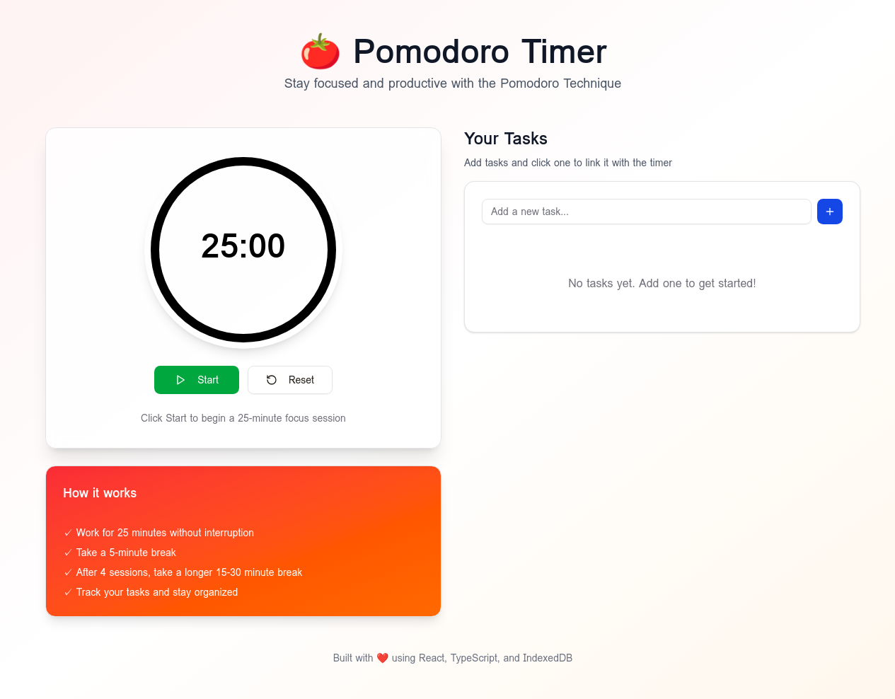

# 🍅 Pomodoro Timer PWA

A modern, feature-rich Progressive Web App (PWA) for the Pomodoro Technique with task management and offline support.



## ✨ Features

### Core Functionality

- **25-Minute Pomodoro Timer** - Classic Pomodoro technique implementation
- **Canvas-Based Visualization** - Beautiful circular progress indicator
- **Timer Controls** - Start, Stop, and Reset with visual feedback
- **Browser Notifications** - Get notified when your Pomodoro session completes
- **Browser Title Updates** - See remaining time even when tab is inactive

### Task Management

- **Add Tasks** - Create and manage your to-do list
- **Link Tasks to Timer** - Click a task to start a focused Pomodoro session
- **Task Highlighting** - Visual indication of active task
- **Delete Tasks** - Remove completed or unwanted tasks
- **Persistent Storage** - All tasks saved locally using IndexedDB

### Progressive Web App

- **Offline Support** - Works without internet connection
- **Installable** - Add to home screen on mobile and desktop
- **Service Worker** - Smart caching for optimal performance
- **Responsive Design** - Works seamlessly on all devices
- **App Icons** - Beautiful tomato-themed icons

## 🚀 Getting Started

### Prerequisites

- Node.js 18+ and pnpm installed
- Modern web browser with PWA support

### Installation

1. Clone the repository:

```bash
git clone https://github.com/yourusername/pomodoro-timer.git
cd pomodoro-timer
```

2. Install dependencies:

```bash
pnpm install
```

3. Start the development server:

```bash
pnpm dev
```

4. Open your browser and navigate to `http://localhost:3000`

### Building for Production

```bash
pnpm build
```

The production-ready files will be in the `dist` folder.

## 📖 How to Use

1. **Start a Session**: Click the green "Start" button to begin a 25-minute focus session
2. **Add Tasks**: Type your task in the input field and press Enter or click the + button
3. **Link Task to Timer**: Click on any task to automatically start a new Pomodoro session for that task
4. **Stop/Reset**: Use the Stop button to pause or Reset to restart the timer
5. **Install as App**: Click the install prompt in your browser to add the app to your home screen

### The Pomodoro Technique

1. Work for 25 minutes without interruption
2. Take a 5-minute break
3. After 4 sessions, take a longer 15-30 minute break
4. Track your tasks and stay organized

## 🛠️ Technology Stack

- **Frontend Framework**: React 19 with TypeScript
- **Styling**: Tailwind CSS 4 + shadcn/ui components
- **State Management**: React Hooks
- **Data Persistence**: IndexedDB
- **Graphics**: HTML5 Canvas
- **PWA**: Service Worker + Web App Manifest
- **Build Tool**: Vite
- **Notifications**: Web Notifications API

## 📁 Project Structure

```
pomodoro-timer/
├── client/
│   ├── public/
│   │   ├── icon-192.png          # PWA app icon (192x192)
│   │   ├── icon-512.png          # PWA app icon (512x512)
│   │   ├── manifest.json         # PWA manifest
│   │   └── sw.js                 # Service Worker
│   ├── src/
│   │   ├── components/
│   │   │   ├── TimerCanvas.tsx   # Canvas-based timer visualization
│   │   │   ├── TimerControls.tsx # Start/Stop/Reset buttons
│   │   │   └── TaskList.tsx      # Task management component
│   │   ├── hooks/
│   │   │   └── useTimer.ts       # Timer logic hook
│   │   ├── lib/
│   │   │   └── db.ts             # IndexedDB utilities
│   │   ├── pages/
│   │   │   └── Home.tsx          # Main page
│   │   └── App.tsx               # App root
│   └── index.html
├── README.md
└── package.json
```

## 🎨 Features in Detail

### Timer Hook (`useTimer`)

Custom React hook that manages:

- Timer state (running, paused, completed)
- Time remaining calculation
- Progress percentage
- Active task tracking
- IndexedDB persistence
- Browser title updates

### IndexedDB Storage

Persistent local storage for:

- All tasks with metadata
- Timer state (time remaining, running status)
- Active task ID
- Auto-save on page unload

### Service Worker

Implements:

- Cache-first strategy for offline support
- Dynamic caching for runtime assets
- Cache versioning and cleanup
- Background sync capabilities

## 🌐 Browser Support

- Chrome/Edge 90+
- Firefox 88+
- Safari 14+
- Opera 76+

All modern browsers with PWA and IndexedDB support.

## 📝 License

MIT License - feel free to use this project for personal or commercial purposes.

## 🤝 Contributing

Contributions are welcome! Please feel free to submit a Pull Request.

1. Fork the repository
2. Create your feature branch (`git checkout -b feature/AmazingFeature`)
3. Commit your changes (`git commit -m 'Add some AmazingFeature'`)
4. Push to the branch (`git push origin feature/AmazingFeature`)
5. Open a Pull Request

### 🤖 GitHub Copilot Custom Agent

This repository includes a custom GitHub Copilot agent (`@pomodoro-fullstack-expert`) that specializes in:

- React 19, TypeScript, and PWA development
- Code review and quality assurance
- Bug hunting and performance optimization
- IndexedDB and Service Worker best practices

To use the agent in GitHub Copilot Chat:

```
@pomodoro-fullstack-expert [your question or request]
```

See [.github/agents/README.md](.github/agents/README.md) for more details.

## 🐛 Known Issues

- Dark mode is not yet implemented
- Break timer (short/long breaks) is planned for future release
- Statistics tracking is planned for future release

## 🔮 Future Enhancements

- [ ] Dark mode toggle
- [ ] Break timer (5-minute short break, 15-30 minute long break)
- [ ] Session statistics and history
- [ ] Customizable timer durations
- [ ] Sound notifications with volume control
- [ ] Task editing functionality
- [ ] Export/import tasks
- [ ] Multiple timer presets

## 💡 Inspiration

This project is based on the Pomodoro Technique developed by Francesco Cirillo in the late 1980s. The technique uses a timer to break work into intervals, traditionally 25 minutes in length, separated by short breaks.

## 📧 Contact

For questions or suggestions, please open an issue on GitHub.

---

**Built with ❤️ using React, TypeScript, and IndexedDB**
